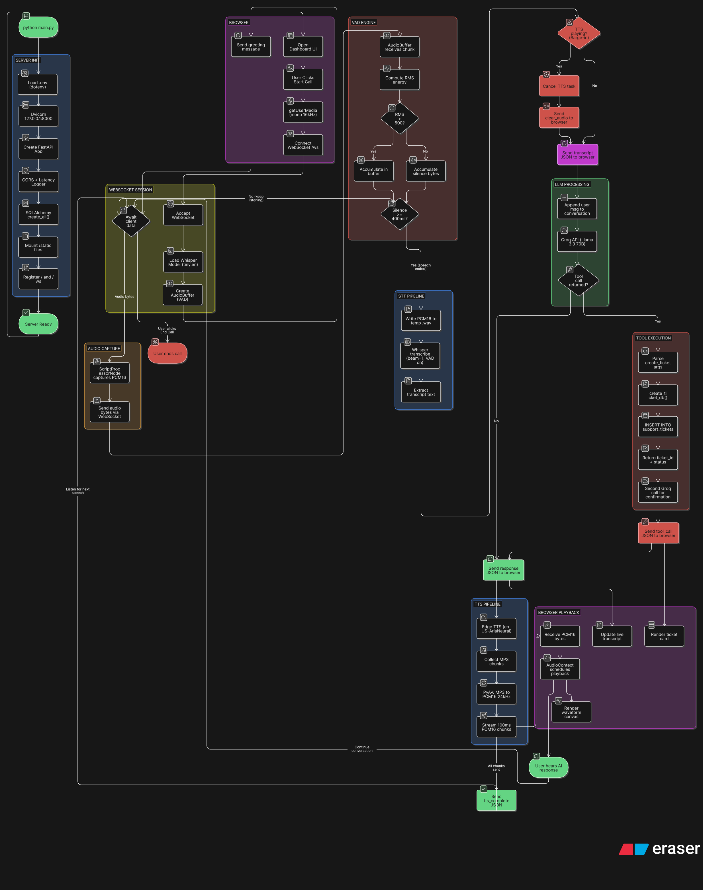

# 🎙️ AI Voice Agent — Mission Control


## 💸 Why Build Custom? (90% Cost Reduction)

By bypassing managed Voice-AI platforms like Retell AI, Vapi, or Synthflow, this architecture minimizes high inference markup multipliers. Exposing local Whisper layouts and direct Async generators consumes up to **90% less operating expense metrics** for scaled customer support dashboards.


## 🏗️ System Architecture



A production-ready, conversational AI Customer Support Voice Agent. Built to demonstrate a complete system architecture (Speech-to-Text → LLM → Text-to-Speech) using high-performance local and free-tier components.

## ✨ Features

- **Autonomous RAG Engine:** Built-in **Retrieval-Augmented Generation** — drop your manuals (`.txt`, `.md`, `.pdf`) into the `knowledge/` folder, and the AI will answer questions based on them.
- **Ultra-Accurate STT:** Powered by **Faster-Whisper** (`small.en`, 244M params) for superior recognition of names and accents.
- **Low-Latency Streaming:** Sentence-level **Text-to-Speech streaming** — hear the response instantly as it generates.
- **Fast LLM Inference:** **Groq (Llama 3.3 70B)** for millisecond reasoning and professional support persona.
- **Smart Ticket Tracking:** Autonomous **Support Ticket Management** — the AI updates existing tickets rather than cluttering with duplicates.
- **Barge-in Logic:** Full duplex support — interrupts cancel ongoing TTS and process new speech immediately.
- **Mission Control UI:** Cyberpunk dark-mode HUD with live waveforms, real-time ticket tracking, and system health status.
- **Zero-Cost STT/TTS:** Runs entirely on high-performance local models and free-tier neural APIs.

## 🛠️ Tech Stack

- **Backend:** Python + FastAPI (WebSocket streaming)
- **Frontend:** Vanilla HTML/CSS/JS (**Share Tech Mono + Fira Code + IBM Plex Sans** fonts)
- **Database:** SQLite via SQLAlchemy
- **AI:** `faster-whisper` (local STT), `edge-tts` (neural TTS), `groq` (Llama 3.3 LLM)

## 📂 Project Structure

```text
.
├── app/
│   ├── core/
│   │   ├── config.py         # Environment config
│   │   └── logger.py         # Logging middleware
│   ├── db/
│   │   └── database.py       # SQLAlchemy models
│   ├── routers/
│   │   └── websocket.py      # Real-time streaming handler
│   ├── services/
│   │   ├── agent.py          # LLM logic & tool definitions
│   │   ├── rag.py            # RAG Engine (Retrieval-Augmented Generation)
│   │   └── whisper_client.py # Whisper STT & Edge TTS
│   ├── static/
│   │   ├── index.html        # Dashboard UI
│   │   ├── script.js         # Audio capture & WebSocket logic
│   │   └── style.css         # Dark-mode styling
│   └── main.py               # FastAPI app application factory
├── data/
│   └── knowledge_index.json  # RAG vector index
├── knowledge/                # Text files & PDFs for RAG
├── main.py                   # Entry point
├── requirements.txt          # Dependencies
└── .env                      # API keys (Groq only)
```

## 🚀 Getting Started

### Prerequisites
- Python 3.9+
- **[Groq Cloud API Key](https://console.groq.com/keys)**

### Setup

```bash
git clone https://github.com/Abdullah-Zafarr/Customer-Support-Voice-Agent-.git
cd Customer-Support-Voice-Agent-

python -m venv .venv
.\.venv\Scripts\activate        # Windows
# source .venv/bin/activate     # Mac/Linux

pip install -r requirements.txt
```

### Configure

Create `.env` in the root directory:

```env
GROQ_API_KEY="your_groq_api_key_here"
```

### Run

```bash
python main.py
```

Open **http://127.0.0.1:8000** → Click **Start Call** → Speak.

## 🔍 Retrieval-Augmented Generation (RAG)

The agent is equipped with a custom-built RAG engine that allows it to act as a domain expert for your specific documentation.

- **Automated Ingestion:** The server automatically scans the `knowledge/` directory on startup.
- **Neural Search:** Uses the `all-MiniLM-L6-v2` transformer model to convert text into high-dimensional vectors.
- **Lightweight Index:** No complex database needed — uses a local `numpy`-based cosine similarity search for sub-millisecond retrieval.
- **Supported Formats:** Just drag and drop `.md`, `.txt`, or `.pdf` files into the `knowledge/` folder.

## 🧠 Pipeline

1. Browser captures audio → 16kHz PCM16 via WebSocket.
2. Server-side **Energy-Based VAD** triggers transcription.
3. **Faster-Whisper (small.en)** transcribes locally.
4. **Groq (Llama 3.3)** generates response + tool arguments.
5. **Edge TTS** generates audio **sentence-by-sentence** for lowest possible latency.
6. **PyAV** decodes → PCM16 chunks streamed instantly to browser.


